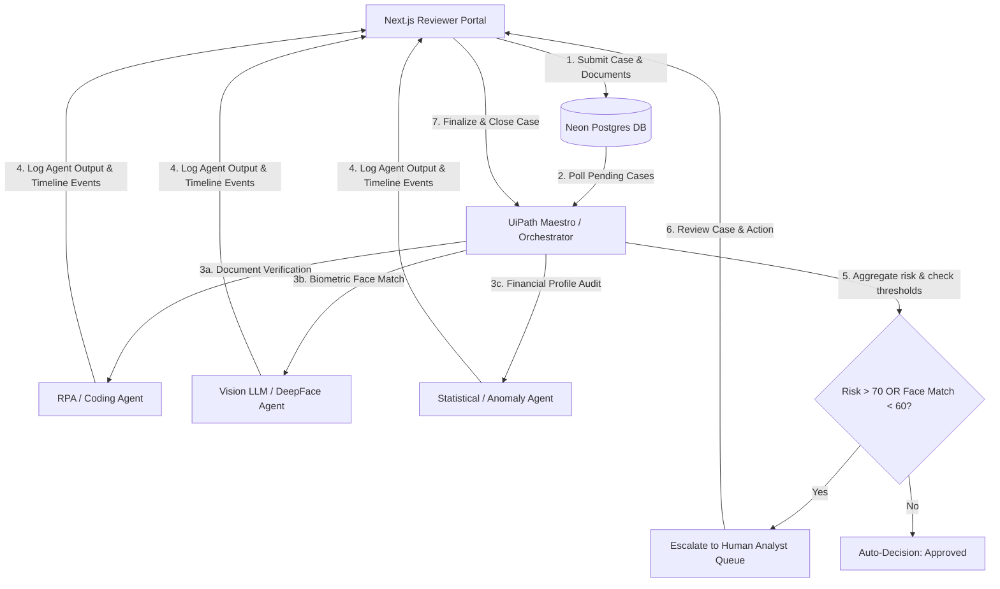

# Synthetic Identity Fraud Investigation Queue & Reviewer Portal
> **Submission for UiPath AgentHack Hackathon** (Track 1: UiPath Maestro Case)

An enterprise-ready **Human-In-The-Loop (HITL) Case Management and Investigation Portal** for detecting and resolving **Synthetic Identity Fraud (SIF)**. This application serves as the user-facing reviewer dashboard and orchestration monitor, connecting seamlessly with the **UiPath Automation Cloud** (Maestro Case & Orchestrator) to govern coding agents, automate risk checks, and escalate high-risk exceptions to fraud analysts.

---

## 🏗️ System Architecture

The following diagram illustrates how the Next.js Reviewer Portal interfaces with the **UiPath Platform** as the core orchestration and execution plane.



---

## 🛠️ UiPath Maestro Case Integration (Track 1)

This solution implements a **dynamic, exception-heavy business process** utilizing UiPath's case management capabilities:
1. **Intake**: Case metadata and government IDs/selfies/statements are submitted via the Next.js frontend.
2. **Orchestration**: UiPath Maestro initiates the case investigation, coordinating multi-agent checks:
   - **Document Verification Agent**: Performs OCR and matches names/DOBs. Handles the **missing document exception** by routing the case back to the applicant and updating the status to `needs_documents`.
   - **Face Verification Agent**: Runs biometric verification. If face similarity falls below 60%, it raises a **biometric exception** routing the case immediately to the Analyst Queue.
   - **Email & Phone Risk Agent**: Performs real-world MX record checks and phone parsing via `libphonenumber-js`.
   - **Financial Pattern Agent**: Compares declared salary with bank statement inflows, identifying income anomalies.
3. **Risk Aggregation**: A centralized **Fraud Decision Agent** aggregates the scores.
4. **Human-in-the-Loop**: High-risk cases (risk score > 70) or cases with active exceptions (e.g. face mismatch) are routed to the Next.js **Analyst Review Panel** for human adjudication (Approve, Reject, or Request Documents).

---

## ⚡ UiPath REST API Gateway

The application provides a dedicated, bi-directional integration API under `/api/uipath` for UiPath Robots, Studio workflows, and Maestro Case activities to synchronize case states.

### 1. Poll Pending Cases
Retrieve cases ready for analysis.
* **Endpoint**: `GET /api/uipath?action=get-cases`
* **Query Parameters**:
  - `stage`: Filter by stage (e.g. `case_created`, `document_verification`)
  - `status`: Filter by status (e.g. `created`, `investigating`)
* **Response**:
  ```json
  {
    "success": true,
    "cases": [
      {
        "id": "787bb7b9-...",
        "case_number": "SIF-2026-06-1234",
        "applicant_name": "Arjun Verma",
        "status": "created",
        "current_stage": "case_created"
      }
    ]
  }
  ```

### 2. Update Case Stage
Transition a case to a new stage in the Maestro lifecycle.
* **Endpoint**: `POST /api/uipath`
* **Body**:
  ```json
  {
    "action": "update-stage",
    "caseId": "787bb7b9-...",
    "stage": "identity_verification",
    "status": "investigating"
  }
  ```

### 3. Log Agent Output
Save detailed output and findings from a specific coding/RPA agent.
* **Endpoint**: `POST /api/uipath`
* **Body**:
  ```json
  {
    "action": "add-agent-output",
    "caseId": "787bb7b9-...",
    "agent": "document_agent",
    "stage": "document_verification",
    "status": "completed",
    "score": 15,
    "result": { "name_mismatch": false, "dob_mismatch": false },
    "reasons": ["Aadhaar matches application name and DOB"]
  }
  ```

### 4. Log Case Event (Timeline Audit Trail)
Add a timeline event to display in the case audit trail.
* **Endpoint**: `POST /api/uipath`
* **Body**:
  ```json
  {
    "action": "add-event",
    "caseId": "787bb7b9-...",
    "stage": "financial_analysis",
    "eventType": "anomaly",
    "message": "Outlier income detected vs declared monthly salary",
    "actor": "financial_agent"
  }
  ```

### 5. Finalize Risk Report
Generate the consolidated risk report for reviewer evaluation.
* **Endpoint**: `POST /api/uipath`
* **Body**:
  ```json
  {
    "action": "create-report",
    "caseId": "787bb7b9-...",
    "riskScore": 85,
    "riskLevel": "HIGH",
    "summary": "Weighted high-risk synthetic signals detected.",
    "reasons": ["Biometric mismatch", "VOIP line phone used"],
    "agentBreakdown": { "document": 15, "face": 75, "email_phone": 40, "financial": 12 },
    "recommendation": "Escalate to high-priority analyst review."
  }
  ```

### 6. Close Case
Record the final decision on a case.
* **Endpoint**: `POST /api/uipath`
* **Body**:
  ```json
  {
    "action": "close-case",
    "caseId": "787bb7b9-...",
    "decision": "approved",
    "note": "Analyst verified physical address details",
    "analyst": "Analyst Queue"
  }
  ```

---

## 🤖 UiPath Studio Orchestration Project

We have included a complete, pre-configured **UiPath Studio Project** under the [uipath-orchestrator-project](file:///c:/Users/mahek/Downloads/synthetic-identity-fraud/uipath-orchestrator-project) directory.

### Project Files
* **[project.json](file:///c:/Users/mahek/Downloads/synthetic-identity-fraud/uipath-orchestrator-project/project.json)**: Declares project metadata and WebAPI packages.
* **[Main.xaml](file:///c:/Users/mahek/Downloads/synthetic-identity-fraud/uipath-orchestrator-project/Main.xaml)**: The orchestration workflow. It fetches pending cases from the Next.js API, deserializes the JSON list, iterates through cases to update their stages, posts agent audit results, calculates risk, and either auto-approves or escalates them to human review.

### Running in UiPath Studio
1. Open **UiPath Studio** and click **Open Local Project**.
2. Select the `project.json` file inside [uipath-orchestrator-project](file:///c:/Users/mahek/Downloads/synthetic-identity-fraud/uipath-orchestrator-project).
3. Open `Main.xaml`.
4. In the Variables panel, update `ApiBaseUrl` to point to your deployed Next.js web portal (or keep it as `http://localhost:3000` for local testing).
5. Click **Run** to execute the automation.

---

## ⚙️ Setup & Installation

### 1. Prerequisites
- **Node.js** (v18.x or above)
- **PostgreSQL Database** (Neon Serverless recommended)
- **OpenAI API Key** (for Vision/OCR and decision-making LLM calls)

### 2. Configuration
Create a `.env.local` or `.env` file in the root folder using the [.env.example](.env.example) template:
```bash
cp .env.example .env
```
Fill in the values:
- `DATABASE_URL`: Connection string to your database.
- `OPENAI_API_KEY`: Your OpenAI API key.
- `OPENAI_MODEL`: Set to `gpt-4o-mini` (or `gpt-4o`).

### 3. Database Migration
Run the SQL queries in [schema.sql](schema.sql) on your Postgres database instance to create the necessary tables, relationships, and indices.

### 4. Running the Dashboard
Install local dependencies and run the Next.js development server:
```bash
# Install dependencies
npm install

# Start Next.js dev server
npm run dev
```
Open [http://localhost:3000](http://localhost:3000) to view the portal.

---

## 🎓 License
This project is licensed under the **MIT License** - see the LICENSE details for details.
